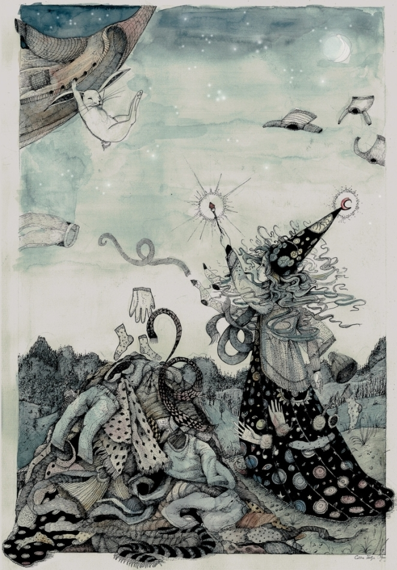

#### Bátornyuszi és a repülő kardigán

_-Apa, mesélsz nekem egy repülő kardigánról? Bátornyusziról és egy repülő kardigánról!_

_-Egy repülő kardigánról? Hűha, az nem lesz könnyű... hm… na jó, figyelj csak!_

Volt egyszer egy gyönyörű, kerek rét, és körülötte egy sűrű, mély erdő.

Ezen a réten, és ebben az erdőben élt egy csapat nyuszi.
Pontosan százan voltak.

A százból kilencvenkilenc szokásos, sima, átlagos nyuszi volt.

De a századik - különleges volt. Mert ő bátor volt.
Így is hívták: Bátornyuszi.

Egy forró nyári estén a nyuszik épp vacsoráztak, mikor igen furcsa dolgot pillantottak meg a fejük felett: magasan a levegőben egy kardigán repült lassan, komótosan, a karjaival szárnyként csapdosva. A nyuszik felugrottak és utánaszaladtak: -Kapjuk el, kapjuk el!.

A kardigán átrepült a nyulak rétje felett, az erdő fölé. A nyuszik felugráltak a levegőbe, de túl magasan volt. Végül Bátornyuszinak támadt egy ötlete: 

-Hozzunk egy kötelet, készítsünk belőle lasszót, és kapjuk el azzal!

Nemsokára négy vagy öt nyuszi állt az erdőben, egy nagy kövön. Bátornyuszi meglengette a lasszót, eldobta, az pedig a kardigán köré tekeredett. Ám olyan ereje volt a kardigánnak, hogy a magasba emelte Bátornyuszit is.

-Tartsatok meg! – kiáltotta Bátornyuszi. Egy másik nyuszi is belekapaszkodott a kardigánba, de ő is felemelkedett a magasba. Végül, mikor már négy vagy öt nyuszi egymáson csüngött, nagy nehezen le tudták húzni a kardigánt.

-Most aztán mihez kezdjünk vele? – gondolkoztak. Végül megállapodtak, hogy a kardigán takarónak lesz a legjobb, és eldöntötték, hogy elsőnek Bátornyuszit illeti meg.

Bátornyuszi pompásan aludt azon az éjszakán, mert a kardigán jó meleg volt. De az éjszaka közepén egyszer csak arra riadt fel, hogy a kardigán újra mozgolódni, és karjaival csapkodni kezd. Bátornyuszi megpróbálta megfogni, de a kardigán erősebb volt. Így hát Bátornyuszi végül azt mondta:

-Hát jó. Ha repülni akarsz, hát repülj!

Erősen belekapaszkodott, és hagyta, hogy a kardigán felemelje magával a magasba, az erdő legmagasabb fáinál is magasabbra.

Ezen az éjszakán az erdő azon állatainak, akik még ilyen későn is ébren voltak, igazán különleges látványban volt részük: az erdő felett, a legmagasabb fáknál is magasabban egy kardigán repült, karjaival szárnyként csapdosva, a kardigánba pedig egy nyuszi kapaszkodott minden erejével, nehogy leessen. A bagoly, a róka, a mosómedve és a többiek csak néztek fölfele, és hitetlenkedve csóválták a fejüket.
Bátornyuszi és a kardigán hosszú órákon át repültek, erdők, mezők, völgyek és folyók felett. Végül Bátornyuszi egy dombot pillantott meg. A domb tetején egy lány állt; a varázslók ruháját viselte, kezében varázspálca volt. Egyfolytában varázsolt. A kardigán a domb fölé, épp egy nagy halomhoz repült. Ott aztán megállt egy pillanatra a levegőben, majd leejtette magát Bátornyuszival együtt a halom tetejére. Szerencsére a halom puha volt, mivel más ruhákból állt: kabátokból, pulóverekből, nadrágokból.
Bátornyuszi látta, hogy minden irányból különféle ruhadarabok repülnek a domb és a varázslólány felé, és amikor a ruhahalom fölé érnek, ugyanúgy rápottyantják magukat, ahogy a kardigán tette.

Bátornyuszi odalépett a lányhoz, és megszólította:

-Szia, Bátornyuszi vagyok, téged hogy hívnak?

-Natali vagyok.

-Mit csinálsz ezen a dombon ilyen késő éjszaka?

-Meleg ruhákat varázsolok magamnak.

-Ilyen nyári melegben? De hát miért?

-Mert fázom...mert el vagyok átkozva.

...és Natali mesélni kezdett. Elmondta, hogy egy varázslófaluból származik, ahol mindenki tud varázsolni, és hogy egy nap, hosszú évekkel ezelőtt, mikor még kislány volt, játszani szeretett volna a szomszédjukkal, aki egy vén, házsártos és nagyhatalmú varázsló volt, de annak sajnos nem volt kedve. Natali kérte, kérlelte, fenyegetett, kiabált, de semmi sem segített. Végül Natali annyira megdühödött, hogy letaposta a vén, házsártos és nagyhatalmú varázsló szeretett rózsáit, egyiket a másik után. Mikor a varázsló ezt meglátta, éktelen haragra gerjedt, és szörnyű átkot mondott Natalira: száműzte erre a dombra, és örök fázásra ítélte.

-Sohasem tudod elhagyni ezt a dombot? – kérdezte Bátornyuszi.

-Nem - válaszolta Natali - egy láthatatlan fallal van körülvéve, ami mindenkit átenged, csak engem nem.

Bátornyuszi elhatározta, hogy mindenképp segít a varázslólányon, és útnak indult a varázslók falva felé.
Bátornyuszi megtalálta a varázslófalut, és abban a vén, házsártos és nagyhatalmú varázsló házát; bekopogott, és kisvártatva szemben állt az idős, szigorú tekintetű varázslóval.

-Varázsló - szólt Bátornyuszi - szüntesd meg az átkot, amivel Natalit sújtottad!

-Szó sem lehet róla – mondta mérgesen a varázsló - letaposta a gyönyörű, szeretett rózsáimat. Soha többé nem fognak virágozni.

-Natali eleget szenvedett már.

-Nem, nem és nem!

Bátornyuszi körbenézett. Megakadt a szeme a letaposott, virágjait és leveleit vesztett rózsatöveken, melyek eltörve feküdtek a földön; támadt egy ötlete.

-Varázsló, ha a rózsaid újra virágoznának, megszüntetnéd az átkot?

-Ez ugyan lehetetlen, de ha valóban újra virágoznának, rendben, visszavonom az átkot.

Így hát Bátornyuszi visszaindult az erdejébe, három napon és éjszakán keresztül szaladt és szaladt. Mikor megérkezett, segítséget kért az erdő lakóitól. Négy nyuszi, tíz vakond, száz földigiliszta és egy vadkan tért vissza a varázslók falujába Bátornyuszival. Mikor megérkeztek, máris munkához láttak: a nyuszik óvatosan felállították a rózsatöveket, a vakondok leástak a gyökerekig és megtisztították őket, a giliszták megforgattak a földet, a vadkan pedig, hát, rácsinált, hogy megtrágyázza.

Mikor mindezzel végeztek, Bátornyuszi azt mondta a vén, házsártos és nagyhatalmú varázslónak:

-Várd meg a következő nagy esőt, és aztán számolj három napot: akkor visszatérek.

Úgy is lett. A következő nagy eső után, a harmadik napon Bátornyuszi visszatért a varázslók falujába, és lássatok csodát: a rózsák újra virágoztak, szebbek voltak, mint valaha.

A vén, házsártos és nagyhatalmú varázsló pedig nem hitt a szemének: 

-Az én gyönyörű, imádott rózsáim újra virágoznak!

-Varázsló – mondta Bátornyuszi – tartsd be az ígérteted! Szüntesd meg az átkot!

Kisvártatva Bátornyuszi újra a dombon állt, és így szólt Natalihoz: 

-Az átoknak vége; hazatérhetsz. 

Natali és Bátornyuszi együtt tértek vissza a varázslók falujába. Natali és a szülei ezen az estén a világ legboldogabb emberei voltak, és hét nap és hét éjszaka ünnepeltek és táncoltak.

Mivel Natali szülei is varázslók voltak, eldöntötték, hogy megjutalmazzák az állatokat: így az öt nyúl, amely a rózsákat felállította, ezentúl amikor farkas közeledett, láthatatlanná váltak, és soha többé nem kellett a farkasoktól félniük; a vakondok sasszemet kaptak, hogy a földfelszínre is ki tudjanak menni, és meg tudják látogatni a nyuszikat; a gilisztákat a világ leggyorsabb gilisztáivá varázsolták, akik bármilyen veszély elől villámgyorsan be tudják magukat ásni a földbe. A vadkan pedig, nos, ő kapott az erdejébe egy varázspocsolyát, amely télen-nyáron mindig kellemesen langyos volt. Innentől kezdve a vadkan mindennap hosszú órákat fürdött a pocsolyájában, nyáron hogy lehűljön, télen, hogy felmelegedjen.

Bátornyuszi később is legalább évente egyszer meglátogatta Natalit és a szüleit; ilyenkor mindig újra és újra elmesélték egymásnak a történetet, miközben Natali saját készítésű bodzaszörpjét itták.

Itt a vége, fuss el véle.