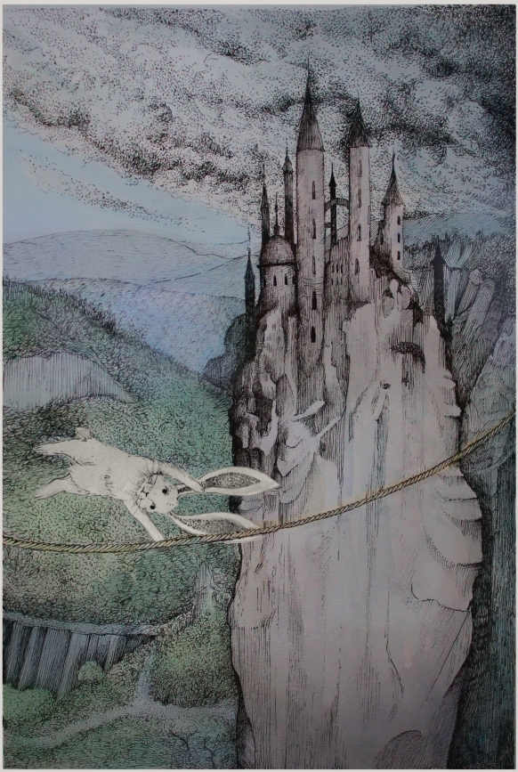

#### Bátornyuszi és a három bátorságpróba

_Volt egyszer egy gyönyörű rét, és körülötte egy hatalmas, sűrű erdő._

_Ezen a réten és ebben az erdőben élt egy csapat nyuszi._

_Pontosan százan voltak._

_A százból kilencvenkilenc szokásos, sima, átlagos nyuszi volt._

_De a századik – különleges volt. Mert ő bátor volt._

_Így is hívták: Bátornyuszi._

Távol a nyuszik rétjétől, messze a herceg városától, élt egyszer egy király a gyönyörű palotájában.
Egy nap megjelent a tróntermében a semmiből egy nagyhatalmú, gonosz varázsló és bejelentette: letaszítja a királyt a trónjáról, és ő fog uralkodni az országon, hacsak nem találtatik egy hős, a következő 30 napban, aki kiállja a három bátorságpróbát.

A király rettenetesen megijedt és rögtön kidoboltatta országszerte, minden hős azonnal siessen a királyi palotába, feladata van a számukra. Az a hős, aki sikerrel jár, ezer arany jutalmat és hercegi címet kap. 

Számos hős jelentkezett a királynál a következő napokban - katonák, lovagok, erőművészek - és indult onnan tovább a gonosz varázsló koromfekete várába, de mind kudarcot vallott. És bárhogy kérdezte is őket a király, egyik sem akarta elárulni, mi is a három bátorságpróba; mindannyian hallgattak.

Eltelt tíz nap, és a király egyre jobban aggódott. Így másodszor is kidoboltatta, hogy hős kerestetik, de most már azt üzente, bárki megpróbálhatja a szerencséjét, aki elég bátornak tartja magát. Jöttek is az egész királyságból mindenféle próbálkozók: favágók, kádárok, tetőfedők, sőt még tolvajok és rablók is. Mind próbára tették a bátorságukat a gonosz varázsló próbáin, de egyik sem járt sikerrel.

Eltelt újabb tíz nap, és a király kezdett kétségbe esni. Mi lehet az a három próba, amin mindenki elbukik?

Végül harmadszor is kidoboltatta, de most nem csak a királysága városaiban és falvaiban, hanem erdein és mezein is, hogy egy rettenthetetlen hősre van szüksége, és nem csak emberek, hanem állatok is jelentkezhetnek.

Így szerzett tudomást Bátornyuszi, csak néhány nappal a határidő lejárta előtt arról, hogy veszélyben az ország. Azonnal útra kelt, de először meglátogatta barátját, a herceg varázslóját, aki csak úgy engedte el, hogy adott neki egy kis, csillogó ajándékot. Azzal útnak indult a király palotájába.

A király hatalmas tróntermében ült, körülötte tanácsadók és szolgálók. Szinte teljesen reményét veszítette. Mikor Bátornyuszi megérkezett és elmondta, azért jött, hogy kiállja a gonosz varázsló három bátorságpróbáját, a király azt sem tudta, nevessen vagy sírjon-e. 

-Te? Egy nyúl? Ahol legvakmerőbb vitézeim elbuktak? – a tanácsadói és szolgálói harsányan kacagtak.

De végül meggondolta magát: - Ó, hát mit számít? Ennél nagyobb már úgysem lehet a baj. Menj, nyúl, próbáld meg te is a szerencsédet.

Bátornyuszi mélyen megbántódott, de nem szólt semmit, hanem sarkon fordult, és útra kelt a gonosz varázsló koromfekete vára felé.

A vár egy sötét, fenyegető erdő mélyén volt, egy fekete hegy csúcsán. Bátornyuszit beengedték a gonosz varázsló szolgálói, és a varázsló elé vezették. Amikor az meglátta Bátornyuszit, hangos, gonosz hahotában tört ki.

-Egy nyú-nyú-nyúl! Már csak egy nyú-nyú-nyulat tudnak küldeni, ha-ha-ha – alig tudta abbahagyni a nevetést, és szolgálói együtt nevettek vele. 

Bátornyuszi rettenetesen mérges lett, de csak annyit mondott: - Még el fog menni a kedvetek a nevetéstől. Hol van hát az a három próba?

-Á, értem, tehát komolyan gondolod. Micsoda jó kis móka lesz ez! – mondta a gonosz varázsló álnokul, és az ablakhoz vezette Bátornyuszit. 

-Látod azt a két nagy hegyet ott? A két hegycsúcs között egy kötél van kifeszítve. Ez az első próba: mássz fel a hegyre, és kelj át a kötélen a szakadék felett. Egyébként tudd meg: az eddigi próbálkozók közül csak minden tizediknek sikerült átjutni a túloldalra.

Bátornyuszi útra kelt, és egész este csak mászott és mászott; végül megérkezett a hegy csúcsára. Szédítően magasan volt: a völgyben az erdő, a házak, mind úgy néztek ki, mintha apró kis játékok volnának. Bátornyuszi nagy levegőt vett, és rálépett a kötélre. Lassan, lépésről lépésre haladt, alatta a végtelen szakadék.

A gonosz varázsló közben a vár ablakából figyelte Bátornyuszit. Amikor a kötél feléhez ért, azt mormolta magában: 

-Ez így túl egyszerű, vigyünk egy kis kihívást a feladatba - majd elővette a varázspálcáját, és varázsolni kezdett. 

Kisvártatva hatalmas vihar tört ki a hegyek között, óriási zivatarfelhők tűntek elő a semmiből, és rettenetes szél kerekedett. A kötél elkezdett vadul ide-oda hintázni, és Bátornyuszinak minden erejével kapaszkodnia kellett, hogy le ne essen. Ám végül, több órányi küzdelem után, megérkezett a kötél végéhez, a másik hegycsúcsra, és a viharnak egyik pillanatról a másikra vége szakadt. 

Néhány órával később Bátornyuszi ismét a gonosz varázsló előtt állt:

-Nos, jelek szerint bátrabb vagy, mint gondolná az ember. De következik a második próba. Gyere velem.

Bevezette Bátornyuszit egy óriási terembe, és Bátornyuszi alig akart hinni a szemének. A teremben ugyanis nem más volt, mint egy hatalmas, zöld sárkány.

-Meg kell küzdened a sárkánnyal - mondta a gonosz varázsló - és túl kell élned tíz percet. Egyébként, ezt a próbát eddig egyetlen jelentkező sem teljesítette. Pontosabban, egy sem állt ki a sárkány ellen.

Bátornyuszi tudta, hogy nincs esélye egy sárkány ellen. Mindenki tudta, hogy a sárkányok világ legerősebb teremtményei, és még a varázslatnak sincs semmi hatása rájuk.

Így azt kérdezte a gonosz varázslótól: - Mondd meg, varázsló; ha kiállok a sárkány ellen, de nem élem túl a 10 percet, megkíméled-e az országot és békén hagyod-e a királyt?

A gonosz varázsló gondolkodott, majd azt válaszolta gonosz vigyorral: - Hát jó. Ha kiállsz a sárkány ellen, de nem éled túl a 10 percet, megkímélem az országot és békén hagyom a királyotokat.

Bátornyuszi sóhajtott egyet, majd azt mondta: - Akkor kezdjük.

A sárkány azonnal támadásba lendült. Bátornyuszinak sikerült az első, óriási csapások elől elugrania, de egyre fáradt, és érezte, nem fogja sokáig bírni. Végül a sárkány egy sarokba szorította; nem volt menekvés. A sárkány nagy levegőt vett, hogy pusztító tüzet fújjon Bátornyuszira.

Bátornyuszi becsukta a szemét, aztán...aztán nem érzett semmit. Mikor újra kinyitotta a szemét, a sárkánynak nyoma veszett, csak a kárörvendőn röhögő varázslót látta.

-Mi történt?

-Valójában nem is volt sárkány a teremben - mondta a gonosz varázsló - amit láttál, illúzió volt, csak látszat. Én varázsoltam. Egy valódi sárkány soha nem fogadna szót senkinek, még nekem sem. De meg kell hagyni, tényleg bátor vagy.

-Mi a harmadik próba? – kérdezte Bátornyuszi elcsigázva.

-A harmadik próba, a harmadik próba, mi is volt? Ja igen...harmadik próba...nincs. Egyszerűen kővé változtatlak, kő leszel az idők végezetéig, és utána még három napig.

-Tessék? Micsoda? De hát miért? Nem ebben állapodtunk meg!

-Nos igen, a próbák... - mondta a gonosz varázsló gonosz mosollyal az arcán - csak arra kellettek, hogy szórakozzak egy jót, mielőtt letaszítom a királyotokat a trónról és átveszem az uralmat az ország fölött. Semmilyen hős nem akadályozhatja meg a tervem végrehajtását. De elég a beszédből – válj kővé!

Elmondta a varázsigét, és pálcájával Bátornyuszira mutatott. A pálcából sárga fénysugár tört elő, azonban Bátornyuszi villámgyorsan egy kis, fénylő tárgyat vett elő, és maga elé tartotta. Egy kis tükör volt. A sárga fény visszaverődött a tükörről, és telibe találta a gonosz varázslót.

A gonosz varázsló felkiáltott: - Hát ez meg mi? Nem...nem...egy varázstükör...neeeeeeeeeeem - és lassan kővé vált.

Az ordítása messzire hallatszott és betöltötte a koromfekete várat. Kisvártatva meg is érkeztek futva, kihúzott karddal a gonosz varázsló szolgálói. - Mi történt az urunkkal? - kérdezték, és kardjukat Bátornyuszira szegezték.

Bátornyuszi törte a fejét, törte keményen, mivel tudta, ha megmondja az igazat, elveszett. Úgy döntött hát, füllenteni fog.

A legszigorúbb, legmélyebb hangon, amit képes volt kiadni magából, azt mondta: - Az uratokat éppen legyőztem varázslópárbajban és kővé változtattam.

A szolgák elbizonytalanodtak: 

-Dehát...a nyulak nem is tudnak varázsolni!

-Ezt gondolta az uratok is. És most engedjetek ki a várból, mert aki utamba áll, azt nyomban ugyanúgy kővé változtatom!

A szolgálók igen nagyon megijedtek, és utat adtak Bátornyuszinak: - Ó, hatalmas varázsló, kérlek kímélj meg bennünket - hátrébb húzódtak, és még ránézni is alig mertek Bátornyuszira. 

Így történt, hogy Bátornyuszi egyenes háttal, peckesen sétált ki a rettegő szolgák között a hatalmas, gonosz varázsló koromfekete várából. 

-Most már nem nevettek rajtam, ugye? - gondolta magában.

Ahogy visszaérkezett a király udvarába, rögtön a királyhoz sietett és azt mondta: 

-A próbákat kiálltam. És a gonosz varázsló miatt sem fog már főni a fejed soha többé.

A király és tanácsadói döbbenten hallgatták. Már senki sem nevetett Bátornyuszin.

-De...hogyan sikerült neked az, ami előtted a legbátrabb hősöknek sem? - kérdezte a király döbbenten.

Ám Bátornyuszi hallgatott, és hogy mi hogyan történt, csak barátjának, a herceg varázslójának mesélte el, akitől a varázstükröt kapta, és persze a 99 másik nyuszinak a gyönyörű, kerek réten, a sűrű, mély erdőben.

Ami pedig a koromfekete vár vidékét illeti...a falvakban és erdőkben azóta is tartja magát a hiedelem, hogy él valahol egy borzasztó hatalmú, félelmetes nyúl-varázsló; és arrafelé soha, senki nem merészelne már egyetlen nyuszit sem bántani.